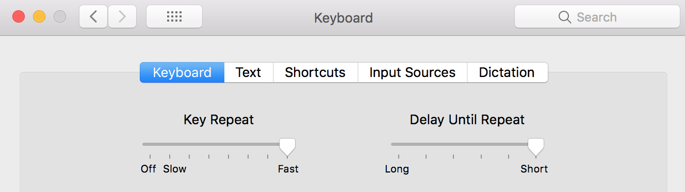
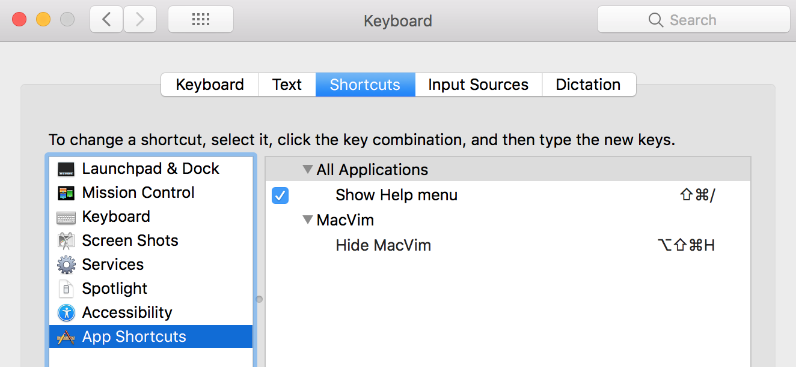

## windows devenv configuration

### keyrepeat settings
To speedup the keyrepeat delay and repeat under windows, i use a tool that i found on stackoverflow. To Compile it you need to have a C Compiler installed on your System. If Visual Studio is installed just press the windows button and enter "Developer Command Prompt for VS2015" and then run the command `cl keyrepeat.c user32.lib`. Right now i use `200 delay` and a `rate 20`
http://stackoverflow.com/questions/171326/how-can-i-increase-the-key-repeat-rate-beyond-the-oss-limit

### keyboard layout settings
Since Vim is only able to process Keyboard input that is a character (and Control) i modified the normal German Keyboard Layout to output characters when AltGr (Control and Alt) is pressed. To do so i used the Microsoft Keyboard Layout Creator 1.4 (downloaded from https://www.microsoft.com/en-us/download/details.aspx?id=22339), loaded (from the File menu) the existing German keyboard configuration and edited it. The changes are saved to a file that is part of the `German-Vim.zip` shipped within this repository if customization is reqired. If not, the already build setup for the keyboard layout is also included in the zip. To use it install it and enter the Windows language settings to configure the Keyboard Layout to be German-Vim. Now if you press AltGr (or Ctrl-Alt) and any character reached with your left hand, a character gets output and can now be used in your vimrc.

### remap capslock to escape
Vim is a lot based around switching modes and you get to enter `normal` mode by hitting the `ESC` key. On the normal keyboard layout the `ESC` key is on the far top left cornor which is quite a way to travel. To make thinks easier, remapping the `CAPS-Lock` key to the `ESC` helps. Doubleclick the escremap.reg file in the repository and restart. 

     REGEDIT4
     [HKEY_LOCAL_MACHINE\SYSTEM\CurrentControlSet\Control\Keyboard Layout]
     "Scancode Map"=hex:00,00,00,00,00,00,00,00,03,00,00,00,3a,00,46,00,01,00,3a,00,00,00,00,00

## os x devenv configuration
### keyrepeat settings
OS X offers keyrepeat settings out of the box. preferences -> keyboard -> keyboard unveils a ui where delay and repeat can be configured via sliders. 

### vim command-x shortcuts
For commands that are not part of the MacVim menu, the keyboard shortcut can be disabled by adding a configuration entry to `.gvimrc` For example to disable the Tools -> List Errors shortcut via `CMD-l` add the following line into the configuration file: `:macmenu Tools.List\ Errors key=<nop>`

Shortcuts residing in the MacVim menu cannot be disabled via the configuration file, but instead need to be reconfigured via System Preferences. To free the `CMD-h` shortcut, that hides all application windows by default, goto `System Preferences -> Keyboard -> Shortcuts` and add a new entry with the Name set to the Operation and assign a keyboard shortcut that you will likley never use.

## platform independent

### hex syntax highlighting
The `vim/vimfiles/syntax/hex.vim` and `vim/vimfiles/ftdetect/hex.vim both enable syntax highlighting in .hex files. 

    00000000: 4d 5a 90 00 03 00 00 00 04 00 00 00 ff ff 00 00  MZ..............
    00000010: b8 00 00 00 00 00 00 00 40 00 00 00 00 00 00 00  ........@.......
    00000020: 00 00 00 00 00 00 00 00 00 00 00 00 00 00 00 00  ................
    00000030: 00 00 00 00 00 00 00 00 00 00 00 00 e0 00 00 00  ................
    00000040: 0e 1f ba 0e 00 b4 09 cd 21 b8 01 4c cd 21 54 68  ........!..L.!Th
    
    hexAddress             hexOctet                                    hexAscii
The three syntax groups `hexAddress, hexOctet, hexAscii` can now be used in colorschemes. For now the format is hardcoded which means 8 digit address, 2 digit octet group and 16 octets per row. To change it, just adjust the syntax file.
